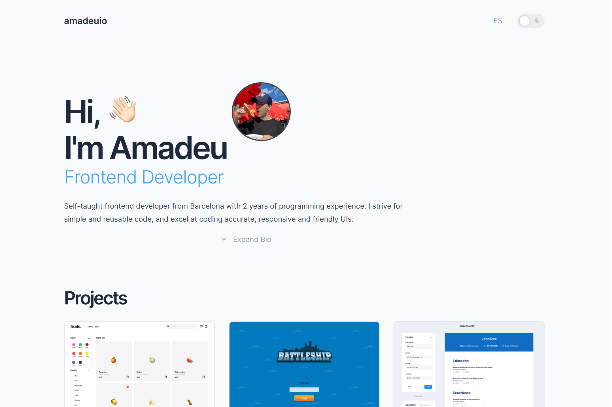

[](https://app.netlify.com/projects/portfolio-amadeuio/deploys) 


# Portfolio

My personal portfolio page with TypeScript and React.

## Demo

<p align="center">
  
</p>
<h2 align="center">
  <a href="https://portfolio-amadeuio.netlify.app/">👉 amadeu.io</a>
</h2>

## About

Simple and aesthetic developer portfolio with Bio, Projects, Skills and Contact sections.

## Features

- Expandable bio
- Night Mode
- ENG and ES languages
- Responsive

## Tech Stack

- **UI Library:** React
- **Languages:** TypeScript, SCSS, HTML
- **Build Tool:** Vite
- **Deployment:** Netlify
- **Dependencies:**
  - MUI: Tooltip

## Run Locally

Clone the project

```bash
git clone git@github.com:amadeuio/portfolio.git
```

Go to the project directory

```bash
cd portfolio
```

Install dependencies

```bash
npm install
```

Start the server

```bash
npm run dev
```

## Acknowledgements

- [Google Icons](https://fonts.google.com/icons)
- [ChatGPT](https://chat.openai.com)

Shoutout to my code companions: Coffee & [Cozy Fireplace](https://www.youtube.com/watch?v=ze-TjhwceFE)

## License

[MIT](https://choosealicense.com/licenses/mit/)
